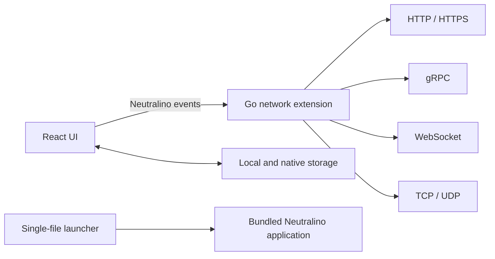

<div align="center">
  

  # OmniPort

  **One compact desktop client for APIs, sockets, and raw network traffic.**

  HTTP · gRPC · WebSocket · TCP · UDP

  [Releases](https://github.com/Gh05t-PL/OmniPort/releases) ·
  [Report a bug](https://github.com/Gh05t-PL/OmniPort/issues) ·
  [Request a feature](https://github.com/Gh05t-PL/OmniPort/issues)
</div>

---

OmniPort is a lightweight, multi-protocol debugging client built for developers
who need more than another HTTP-only tool. It combines everyday API workflows
with native gRPC, WebSocket, TCP, and UDP support in a single desktop
application.

The interface is built with React and Neutralinojs, while network operations run
inside a native Go extension. This keeps networking outside the browser layer,
avoids browser CORS restrictions, and preserves the exact bytes returned by raw
TCP and UDP services.

## Highlights

- Five protocols in one workspace: HTTP, gRPC, WebSocket, TCP, and UDP
- Native networking through a Go extension
- Request tabs, collections, and persistent history
- cURL and OpenAPI imports
- Horizontal and vertical workspace layouts
- Compact, single-file application packages
- Dark, focused interface designed for debugging

## Protocol support

| Protocol | Features |
| --- | --- |
| **HTTP** | Query parameters, headers, raw bodies, URL-encoded forms, multipart uploads, JSON formatting, response headers, and a timing waterfall |
| **gRPC** | Native plaintext calls through server reflection, imported `.proto` files, or protosets; service and method discovery, generated and validated JSON payloads, metadata, headers, trailers, status, and timings |
| **WebSocket** | Custom handshake headers, live incoming and outgoing frames, connection events, message sending, and auto-scroll |
| **TCP** | Text/Hex payload editing, binary file import, reusable sessions, manual read cancellation, configurable framing strategies, response metadata, and lossless Text/Hex views |
| **UDP** | Text/Hex payload editing, binary file import, configurable timeouts, datagram responses, response metadata, and lossless Text/Hex views |

## Binary-safe network inspection

TCP and UDP responses are preserved as raw bytes instead of being forced through
a text encoding. The response panel provides:

- **Text** — a readable UTF-8 representation with safe replacement characters
- **Hex** — offset, hexadecimal bytes, and ASCII columns
- **Headers** — protocol, remote address, byte counts, and detected encoding
- Linked Hex/ASCII highlighting for inspecting individual bytes
- Copying based on the currently selected response view

The response Hex viewer is read-only, while TCP and UDP request payloads can be
edited directly as text or hexadecimal bytes and are persisted losslessly as
Base64.

### TCP read strategies

TCP requests can finish reading when:

- the connection is closed by the peer,
- the socket stays idle for a short period,
- exactly N bytes have been received,
- a binary delimiter has been encountered,
- a 1-, 2-, 4-, or 8-byte length-prefixed frame is complete.

Long-running reads can be stopped manually. A request may also keep its TCP
connection open, allowing subsequent payloads in the same request tab to reuse
the existing session.

## Imports and workflow

OmniPort is intended to remain useful after the first request:

- Import HTTP requests from cURL commands
- Import OpenAPI documents as collections
- Save and organize requests in nested collection folders
- Drag requests and folders to reorder or move them between collections
- Import Postman collections and import/export lossless OmniPort JSON
- Reopen previous requests from history
- Keep multiple requests open in tabs
- Switch between horizontal and vertical layouts
- Generate a ready-to-run `grpcurl` command
- Use local `.proto` files or a `.protoset` when a gRPC server does not expose reflection

## Architecture



The UI owns editing, navigation, presentation, and persisted workspace state.
The Go extension owns network connections, protocol execution, timings, and raw
response bytes.

## Build from source

### Requirements

- Docker with BuildKit support
- GNU Make

Node.js, Go, and the Neutralino CLI do not need to be installed locally. The
Docker build contains the complete toolchain.

### Build commands

```bash
# Windows x64
make build

# Linux x64
make build-linux

# macOS x64
make build-mac

# Windows, Linux, and macOS
make build-all
```

Build artifacts are written to:

```text
dist/v<version-without-dots>/<platform>/
```

For example:

```text
dist/v1050/windows-x64/omniport-single.exe
```

Neutralino extensions normally run as separate processes. OmniPort's launcher
embeds the complete application package, extracts it into a temporary directory,
and starts the Neutralino runtime. The distributed result remains a single
executable.

## Debug logging

Application logs are disabled by default. Enable extension diagnostics when
starting the packaged application:

```bash
omniport-single.exe --omniport-log
```

You can also select the output directory and maximum size of each log file:

```bash
omniport-single.exe \
  --omniport-log \
  --omniport-log-dir=C:\Temp\omniport-logs \
  --omniport-log-max-bytes=1048576
```

The default limit is 2 MB per file with one rotated `.1` file. Logging can also
be enabled with `OMNIPORT_LOG=1`.

## Project structure

```text
src/                   React application
extensions/http/       Native Go networking extension
cmd/launcher/          Single-file application launcher
public/                Source icons and static assets
resources/             Neutralino application resources
scripts/               Build and version utilities
Dockerfile             Reproducible multi-platform build
Makefile               Convenient platform build targets
```

## Current direction

Ideas planned for future iterations include:

- Response export for text and binary data
- Searching and selecting byte ranges in the Hex viewer
- Environment variables and reusable secrets
- Response comparison for text, JSON, and binary data
- Collection runners and response assertions

## Contributing

Bug reports, protocol edge cases, and focused pull requests are welcome. When
reporting a networking issue, include the protocol, target behavior, expected
bytes, and enough sanitized response data to reproduce the problem.

---

<div align="center">
  Built with React, Neutralinojs, and Go.
</div>
